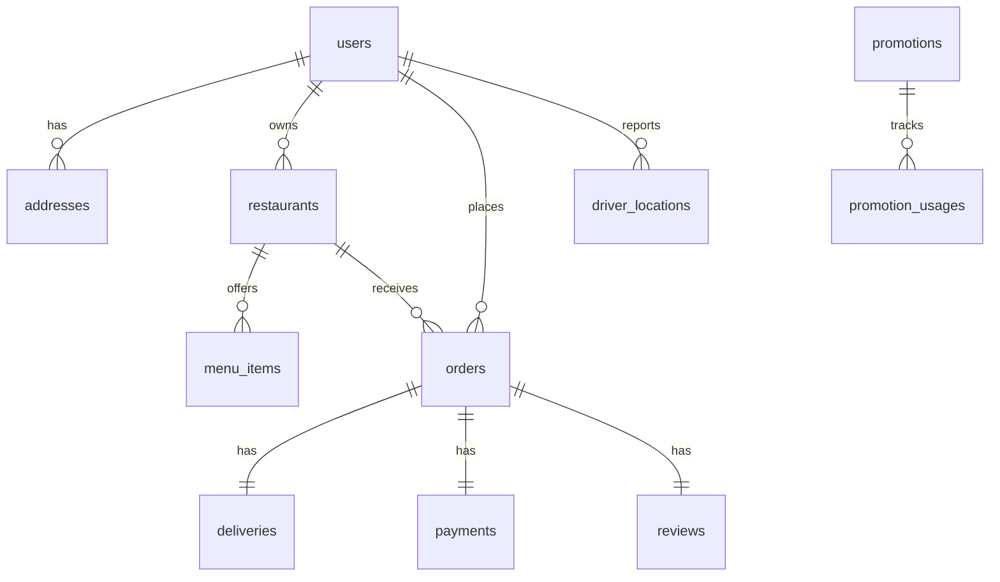

# DATABASE.md

## Core Features
- User Management: `users`, `addresses`
- Restaurant & Menu: `restaurants`, `categories`, `menu_items`, `menu_item_option_groups`, `menu_item_options`
- Cart & Ordering: `carts`, `cart_items`, `orders`, `order_items`, `order_item_options`, `order_status_history`
- Delivery: `deliveries`, `driver_locations`
- Reviews: `reviews`
- Payments: `payments`, `payment_transactions`
- Promotions: `promotions`, `promotion_usages`
- Driver Payouts: `driver_earnings`

## 1. Overview
- **Database:** PostgreSQL 16 + PostGIS extension (geo queries)
- **ORM:** Prisma (`schema.prisma` is single source of truth for migrations)
- **Cache/Queue:** Redis — not a source of truth, no schema defined here
- **Naming conventions:**
  - Tables: `snake_case`, plural (`order_items`)
  - Columns: `snake_case` (`created_at`)
  - Prisma models: `PascalCase` singular (`OrderItem`), mapped via `@@map`
  - Indexes: `idx_<table>_<column>`; unique: `uq_<table>_<column>`

## 2. Entities by Feature

### Feature: User Management
| Entity | Fields | Indexes |
|---|---|---|
| users | id (uuid, PK), email (unique), phone (unique), password_hash, role (enum), full_name, avatar_url, status (enum), created_at, updated_at | uq_users_email, uq_users_phone |
| addresses | id (PK), user_id (FK→users), label, street_address, location (geography Point,4326), is_default, created_at | idx_addresses_user, idx_addresses_location (GIST) |

### Feature: Restaurant & Menu
| Entity | Fields | Indexes |
|---|---|---|
| restaurants | id (PK), owner_id (FK→users), name, description, location (geography), opening_hours (jsonb), status (enum), avg_rating (decimal), version (int) | idx_restaurants_owner, idx_restaurants_location (GIST) |
| categories | id (PK), restaurant_id (FK), name, sort_order | idx_categories_restaurant |
| menu_items | id (PK), restaurant_id (FK), category_id (FK), name, base_price (decimal 10,2), is_available (bool), version (int) | idx_menu_items_restaurant, idx_menu_items_category |
| menu_item_option_groups | id (PK), menu_item_id (FK), name, is_required, min_select, max_select | idx_option_groups_menu_item |
| menu_item_options | id (PK), option_group_id (FK), name, extra_price (decimal) | idx_options_group |

### Feature: Cart & Ordering
| Entity | Fields | Indexes |
|---|---|---|
| carts | id (PK), customer_id (FK→users), restaurant_id (FK) | uq_carts_customer |
| cart_items | id (PK), cart_id (FK), menu_item_id (FK), quantity, selected_options (jsonb), note | idx_cart_items_cart |
| orders | id (PK), order_code (unique), customer_id (FK), restaurant_id (FK), driver_id (FK, nullable), delivery_address_id (FK), status (enum), subtotal/delivery_fee/discount_amount/total_amount (decimal, snapshot), version (int), placed_at | idx_orders_customer, idx_orders_restaurant, idx_orders_driver, idx_orders_status |
| order_items | id (PK), order_id (FK), menu_item_id (FK), item_name_snapshot, item_price_snapshot (decimal), quantity, subtotal | idx_order_items_order |
| order_item_options | id (PK), order_item_id (FK), option_name_snapshot, option_price_snapshot | idx_order_item_options_item |
| order_status_history | id (PK), order_id (FK), status (enum), changed_by (FK→users, nullable), note, created_at | idx_status_history_order |

### Feature: Delivery
| Entity | Fields | Indexes |
|---|---|---|
| deliveries | id (PK), order_id (FK, unique), driver_id (FK), pickup_time, delivery_time, estimated_distance_km, status (enum) | uq_deliveries_order, idx_deliveries_driver |
| driver_locations | id (PK), driver_id (FK), order_id (FK, nullable), location (geography Point), recorded_at | idx_driver_locations_driver, idx_driver_locations_order — append-only, no updated_at |

### Feature: Reviews
| Entity | Fields | Indexes |
|---|---|---|
| reviews | id (PK), order_id (FK, unique), customer_id (FK), restaurant_id (FK, nullable), driver_id (FK, nullable), rating (1-5), comment, created_at | uq_reviews_order, idx_reviews_restaurant |

### Feature: Payments
| Entity | Fields | Indexes |
|---|---|---|
| payments | id (PK), order_id (FK, unique), amount, method (enum), status (enum), created_at, updated_at | uq_payments_order |
| payment_transactions | id (PK), payment_id (FK), idempotency_key (unique), provider_transaction_id, type (enum), status, raw_response (jsonb) | uq_payment_tx_idempotency_key |

### Feature: Promotions
| Entity | Fields | Indexes |
|---|---|---|
| promotions | id (PK), code (unique), restaurant_id (FK, nullable), discount_type (enum), discount_value, min_order_amount, max_discount_amount, usage_limit, usage_limit_per_user, starts_at, ends_at, is_active | uq_promotions_code |
| promotion_usages | id (PK), promotion_id (FK), customer_id (FK), order_id (FK), discount_applied, created_at | idx_promo_usages_promotion, idx_promo_usages_customer |

### Feature: Driver Payouts
| Entity | Fields | Indexes |
|---|---|---|
| driver_earnings | id (PK), driver_id (FK), delivery_id (FK), amount, status (enum), paid_at, created_at | idx_driver_earnings_driver |

### Shared Entities
- `users` and `addresses` are referenced across every feature (customer, vendor owner, driver, admin) — live in `shared/` domain, not owned by a single feature module.

## 3. Relationships

- **Relationship convention:** FK columns named `<entity>_id`; every FK has a matching index.
- **Cross-feature relationships:** `orders` (Ordering) → `restaurants`/`menu_items` (Catalog); `deliveries` (Delivery) → `orders`; `payments` (Payments) → `orders`. These are the only sanctioned cross-feature FK links — no direct FK between e.g. `menu_items` and `payments`.

## 4. Conventions
- **Primary key:** UUID v4 for all tables — avoids exposing record counts, safe for distributed/merge scenarios.
- **Soft delete:** Not used for transactional tables (`orders`, `payments`) — history preserved via `order_status_history` instead. `restaurants`/`menu_items` use `status`/`is_available` flags rather than deletion.
- **Timestamps:** `created_at` on all tables; `updated_at` on mutable tables only (append-only tables like `driver_locations`, `order_status_history` omit it).
- **Enum/Status handling:** Native Prisma `enum` (maps to Postgres `ENUM`), never free-text strings. Status transitions validated in the service layer, not by DB constraints.

## 5. Migration Rules
- **Naming format:** `prisma migrate dev --name <verb>_<entity>`, e.g. `add_version_to_orders`, `create_payment_transactions`.
- **Versioning:** Sequential timestamped folders under `prisma/migrations/`, committed to git — never edited after merge.
- **Rollback policy:** No auto-generated down-migrations; rollback = a new forward migration reversing the change. Destructive changes (drop column/table) go through a two-step process (deprecate → confirm unused → drop) across separate PRs.

## Prisma & PostgreSQL-Specific Patterns
- **PostGIS types:** Not natively typed in Prisma — declare as `Unsupported("geography(Point,4326)")`, query via `$queryRaw` for `ST_DWithin` / `ST_Distance`.
- **Optimistic locking:** `version` int column + `updateMany({ where: { id, version }, data: { version: { increment: 1 } } })`; `count === 0` → throw `ConflictException`.
- **Idempotency:** Unique constraint on `payment_transactions.idempotency_key`; check-then-insert before calling the payment provider.
- **Price snapshotting:** `order_items` / `order_item_options` duplicate name/price at write time — never joined live from `menu_items`.
- **Decimal fields:** Always `@db.Decimal(10,2)`, never `Float`, to avoid rounding errors in money math.
