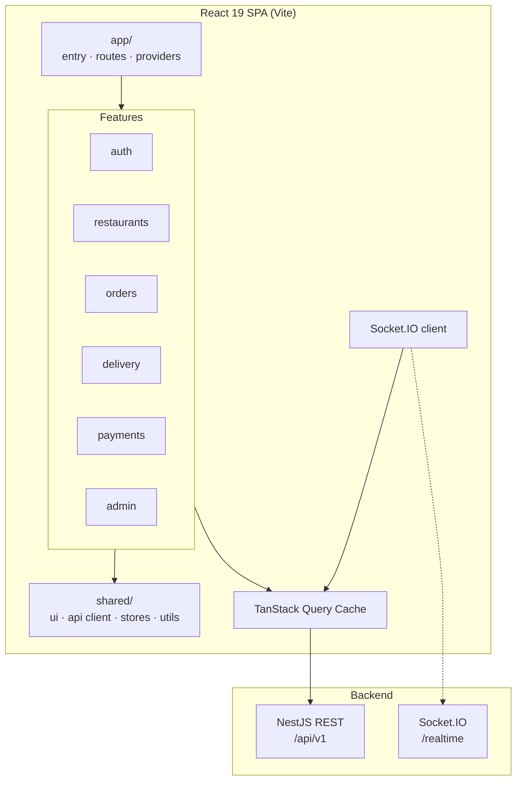
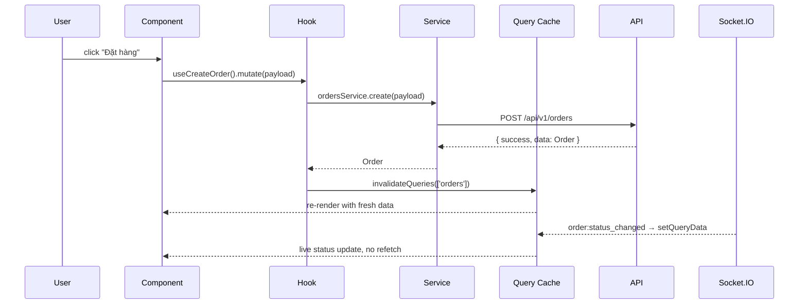
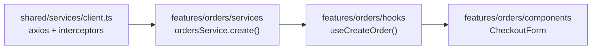

# ARCHITECTURE.md — Frontend

## 1. Overview



**Feature-based rationale:** feature folders mirror the backend features in API_SPEC.md 1:1 (`orders/` ↔ `/orders` + `ORDER_*` error codes). One capability = one folder = one `context.md`. Four role dashboards (customer, vendor, driver, admin) compose the *same* feature modules rather than duplicating them.

**Tech stack justification:**
| Choice | Why |
|---|---|
| React 19 + Vite | SPA behind auth — no SEO need; instant HMR, small config surface |
| TanStack Query | Order/menu data is server-owned and changes in realtime; cache invalidation + `setQueryData` is the natural fit for Socket.IO push |
| Zustand | Only auth + notifications are truly global; a full Redux setup is overkill for one developer |
| Tailwind | Design tokens live in `tailwind.config.ts`; no CSS files to keep in sync across four dashboards |
| Axios | Interceptors needed for JWT attach + 401 refresh-and-retry (API_SPEC §2) |

## 2. Folder Structure

```
src/
├── app/
│   ├── main.tsx                # ReactDOM.createRoot, imports styles
│   ├── App.tsx                 # RouterProvider
│   ├── routes/
│   │   ├── index.tsx           # root route tree, lazy() imports
│   │   ├── ProtectedRoute.tsx  # auth + role gate
│   │   └── routes.config.ts    # path constants (single source of URLs)
│   ├── providers/
│   │   ├── QueryProvider.tsx   # QueryClient config, retry policy
│   │   ├── SocketProvider.tsx  # one Socket.IO instance, app-wide
│   │   └── ToastProvider.tsx
│   └── layouts/                # CustomerLayout, VendorLayout, DriverLayout, AdminLayout
├── shared/
│   ├── components/ui/          # Button, Input, Modal, Skeleton, Badge — presentational only
│   ├── hooks/                  # useDebounce, useGeolocation, useMediaQuery
│   ├── services/
│   │   ├── client.ts           # axios instance + interceptors
│   │   └── socket.ts           # Socket.IO singleton
│   ├── stores/                 # auth.store.ts, notification.store.ts (the ONLY global stores)
│   ├── types/                  # ApiResponse<T>, ApiError, PaginatedResult<T>, Role
│   └── utils/                  # money.ts, date.ts, error-code-map.ts, geo.ts
├── features/
│   ├── auth/                   # login, register, token refresh
│   ├── restaurants/            # geo search, detail, menu, vendor menu CRUD
│   ├── orders/                 # cart, checkout, order list/detail, status timeline
│   ├── delivery/               # driver offers, tracking map, location push
│   ├── payments/               # checkout payment, idempotency key handling
│   ├── promotions/             # promo code apply/validate
│   ├── reviews/
│   └── admin/                  # user approval, global order monitor
├── assets/                     # icons, images, fonts
└── styles/index.css            # @tailwind directives ONLY — no custom CSS
```

## 3. Feature Anatomy

```
features/orders/
├── components/
│   ├── OrderCard.tsx
│   ├── OrderStatusTimeline.tsx
│   ├── CartItemRow.tsx
│   └── OrderCard.test.tsx       # co-located
├── hooks/
│   ├── useOrders.ts             # useQuery(['orders','list',filters])
│   ├── useCreateOrder.ts        # useMutation + invalidation
│   └── useOrderSocket.ts        # order:status_changed → setQueryData
├── services/orders.service.ts   # ONLY place apiClient is called for /orders
├── stores/cart.store.ts         # Zustand — client-only draft state
├── types/orders.types.ts        # Order, OrderStatus, CreateOrderPayload
├── utils/order-status.ts        # allowed transitions, status labels
├── pages/
│   ├── CheckoutPage.tsx
│   ├── OrderListPage.tsx
│   └── OrderDetailPage.tsx
├── index.ts                     # public barrel — the ONLY import surface
└── context.md                   # owned routes · public exports · consumed endpoints
```

## 4. Data Flow



- **Component:** renders, dispatches events. No fetching, no business math.
- **Hook:** TanStack Query wrapper — caching, retry, invalidation, optimistic updates.
- **Service:** axios call + response typing. The only layer that knows URLs.
- **Store:** client-only state (cart draft, filter panel). Server data never lands here.
- **Socket:** writes into the query cache; components stay unaware of the transport.

## 5. Cross-feature Communication

| Method | Use case | Example |
|---|---|---|
| **URL / Router** | Navigation with params — the default | `/orders/:id` is the source of truth for "which order" |
| **Query cache** | One feature's mutation refreshes another's data | `payments` succeeds → `invalidateQueries(['orders','detail',id])` |
| **Global store** | Auth, current user, toasts, app settings | `useAuthStore().user.role` gates the layout |
| **Barrel import of a public hook** | Genuine reuse across features | `import { useRestaurant } from '@/features/restaurants'` |
| **Event emitter** | Rare — decoupled fire-and-forget | logout broadcast clearing all feature caches |

**Forbidden:** importing another feature's `components/`, `services/`, or `types/` by deep path. Everything crosses through `index.ts`.

## 6. Routing Structure

```
Public                          Protected (role-gated)
├── /                           ├── /checkout               CUSTOMER
├── /login                      ├── /orders, /orders/:id     CUSTOMER
├── /register                   ├── /orders/:id/tracking     CUSTOMER
├── /restaurants                ├── /vendor/*                VENDOR
└── /restaurants/:id            ├── /driver/*                DRIVER
                                └── /admin/*                 ADMIN
```

```tsx
// app/routes/index.tsx
const OrderDetailPage = lazy(() => import('@/features/orders/pages/OrderDetailPage'));

{
  path: '/orders/:id',
  element: <ProtectedRoute roles={['CUSTOMER']}><OrderDetailPage /></ProtectedRoute>,
}
```

- **Route config per feature:** each feature exports its own route array from `index.ts`; `app/routes/` composes them — features never edit a shared route file.
- **Lazy loading:** every page is `React.lazy`; each role dashboard is a separate chunk. `<Suspense>` fallback is a layout-matching skeleton, never a spinner on blank.
- **Path constants:** `routes.config.ts` — no hardcoded strings in `navigate()`.

## 7. State Management Strategy

| State Type | Location | Example |
|---|---|---|
| Server state | TanStack Query | Restaurant list, order detail, menu items |
| Realtime server state | TanStack Query (via `setQueryData`) | `order:status_changed`, `delivery:location` |
| Auth | `shared/stores/auth.store.ts` | user, role, access token (in memory) |
| Global UI | `shared/stores/notification.store.ts` | toasts, global modal |
| Feature state | `features/*/stores/*.store.ts` | cart draft, checkout step, map filter panel |
| Local UI | `useState` in component | dropdown open, hovered item |

**Escalation rule:** `useState` → lift to parent → feature store → global store. Never skip a step. Anything the API owns stays in the query cache — never mirrored into Zustand.

## 8. API Layer



- **Base client** (`shared/services/client.ts`): `baseURL` from env, attaches `Authorization: Bearer`, unwraps `{ success, data }`, and on `401 AUTH_1001` runs a single refresh-and-retry (queuing concurrent failures).
- **Error normalization:** every failure becomes `ApiError { code, message, details }`; `error-code-map.ts` maps `ORDER_3009` etc. to user-facing Vietnamese copy.
- **Feature service:** owns endpoint paths and payload/response types mirroring API_SPEC DTOs.
- **Hook:** query keys `['orders','list',filters]` / `['orders','detail',id]` — invalidate by prefix.
- **Component:** consumes the hook only; never sees axios, URLs, or raw error shapes.

## 9. Shared vs Features

| `shared/` | `features/` |
|---|---|
| Generic UI (Button, Modal, Skeleton) | Domain UI (OrderCard, DriverMap) |
| Axios client, socket singleton | Feature services calling specific endpoints |
| Generic hooks (useDebounce, useGeolocation) | Data hooks (useOrders, useDriverOffers) |
| Auth + notification stores | Feature stores (cart, checkout draft) |
| `ApiResponse<T>`, `Role`, `PaginatedResult<T>` | `Order`, `Restaurant`, `Delivery` |
| Pure utils (money, date, error map) | Domain utils (order status transitions) |

Rule of thumb: if it mentions a FoodNow domain noun, it belongs in a feature. If it would work unchanged in a different product, it belongs in `shared/`.

## React 19 & Tooling Additions

- **No SSR/SSG.** Vite SPA — content sits behind auth or is realtime; SEO is not a requirement. If public restaurant pages ever need SEO, prerender that route group separately rather than migrating the app.
- **Provider order** in `App.tsx`: `QueryProvider → SocketProvider → ToastProvider → RouterProvider`. Socket depends on auth token, so it mounts under the auth store.
- **Socket lifecycle:** one instance in `SocketProvider`; features subscribe through their own hook (`useOrderSocket`) and clean up on unmount. Rooms are joined server-side (API_SPEC) — the client only emits `order:subscribe`.
- **Optimistic UI:** `useOptimistic` / `onMutate` for cart quantity and status updates; on `409 ORDER_3009` roll back, refetch the detail query, and surface a retry toast.
- **Derived state during render** — `useMemo`, not `useEffect` + `setState`.
- **Path alias:** `@/` → `src/`. ESLint `no-restricted-imports` blocks `@/features/*/!(index)` to enforce the barrel rule mechanically.
- **Money formatting** happens once in `shared/utils/money.ts` — API returns decimal strings, never parsed into `Number` for arithmetic.
