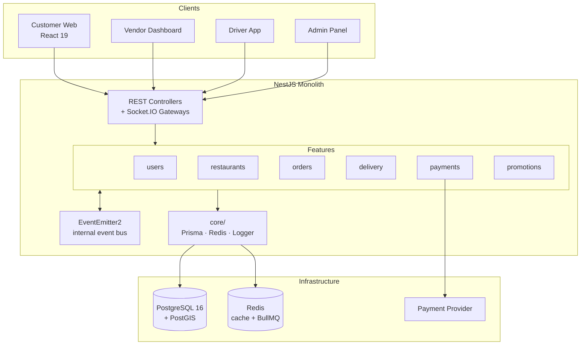
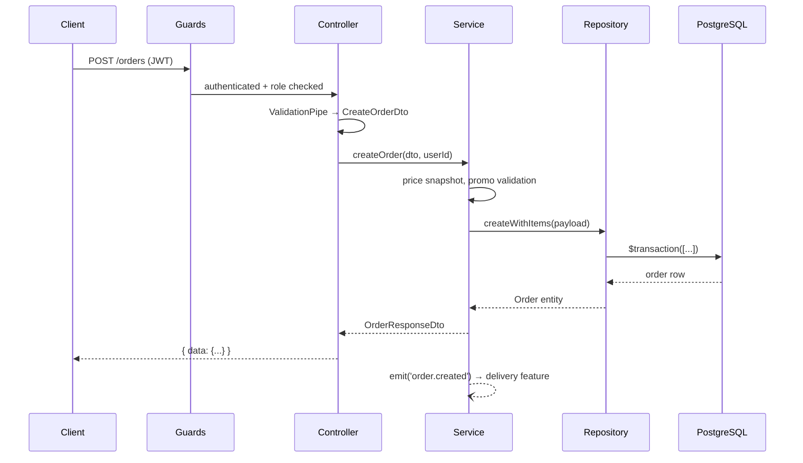
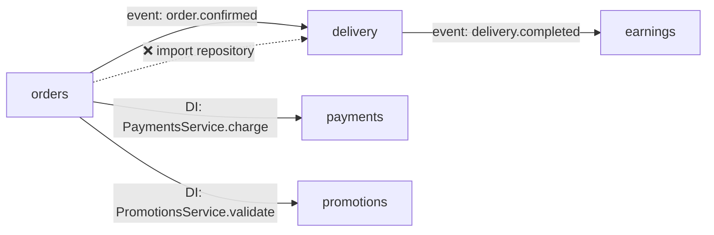

# ARCHITECTURE.md — Backend

## 1. System Overview



**Why feature-based, not layer-based:**
- A change to "driver matching" touches one folder, not four (`controllers/`, `services/`, `repositories/`, `dto/`).
- Feature boundaries mirror the DATABASE.md entity groups — `orders/` owns `orders`, `order_items`, `order_status_history`; nothing else writes to them.
- Onboarding (human or AI assistant) reads one folder + its `context.md` to understand a capability end-to-end.
- Monolith today, but each feature is a clean extraction candidate if a service ever needs to split out (e.g. `delivery/` under load).

## 2. Folder Structure

```
src/
├── main.ts                     # bootstrap, global pipes/filters/interceptors
├── app.module.ts               # imports every feature module
├── config/                     # env schema + typed config namespaces
│   ├── config.module.ts
│   ├── env.validation.ts       # Joi/Zod schema — fails fast on boot
│   ├── database.config.ts
│   └── redis.config.ts
├── core/                       # infrastructure — instantiated ONCE, app-wide
│   ├── database/
│   │   ├── prisma.service.ts   # extends PrismaClient, onModuleInit connect
│   │   └── prisma.module.ts    # @Global()
│   ├── cache/
│   │   ├── redis.service.ts    # cache + pub/sub client
│   │   └── queue.module.ts     # BullMQ registration
│   ├── logger/logger.module.ts
│   └── events/event-bus.module.ts   # EventEmitter2 config
├── shared/                     # stateless, reusable, no infra ownership
│   ├── guards/                 # JwtAuthGuard, RolesGuard
│   ├── decorators/             # @CurrentUser(), @Roles()
│   ├── interceptors/           # TransformInterceptor (response envelope)
│   ├── filters/                # AllExceptionsFilter
│   ├── middlewares/            # RequestIdMiddleware
│   ├── utils/                  # money.util.ts, geo.util.ts, pagination.util.ts
│   └── types/                  # PaginatedResult<T>, JwtPayload, Role enum
└── features/
    ├── users/                  # users, addresses
    ├── restaurants/            # restaurants, categories, menu_items, options
    ├── orders/                 # carts, orders, order_items, status_history
    ├── delivery/               # deliveries, driver_locations
    ├── payments/               # payments, payment_transactions
    ├── promotions/             # promotions, promotion_usages
    ├── reviews/                # reviews
    └── earnings/               # driver_earnings
```

## 3. Feature Anatomy

```
features/orders/
├── orders.controller.ts        # HTTP routes — no business logic
├── orders.gateway.ts           # Socket.IO events (order:status_changed)
├── orders.service.ts           # business logic + public API of this feature
├── orders.repository.ts        # ONLY place PrismaService is touched
├── orders.listener.ts          # @OnEvent handlers from other features
├── orders.module.ts            # DI wiring; exports OrdersService only
├── dto/
│   ├── create-order.dto.ts     # class-validator input
│   └── order-response.dto.ts   # never returns raw Prisma model
├── entities/order.entity.ts    # domain model, decoupled from Prisma types
├── types/orders.types.ts       # OrderSnapshot, StatusTransition
├── utils/order-code.util.ts    # feature-local helpers
├── tests/orders.service.spec.ts
└── context.md                  # owned tables · public API · emitted events
```

## 4. Request Flow



- **Controller:** routing, DTO validation, auth decorators, maps service result → response DTO. Zero business logic.
- **Service:** all business rules — price calculation, status transition validation, optimistic-locking retries, event emission.
- **Repository:** Prisma calls and `$queryRaw` PostGIS queries only. No branching business rules.
- **Gateway:** emits to rooms after the service commits; never contains logic itself.

## 5. Cross-feature Communication



**Allowed:**
1. **Event bus** (`EventEmitter2`) — fire-and-forget, the default. `order.confirmed` → `delivery` starts driver matching; `delivery.completed` → `earnings` records payout.
2. **Dependency injection of a public service** — when a synchronous result is required. `OrdersService` injects `PaymentsService` to charge before confirming.
3. **Shared services** in `shared/` — logic owned by no feature (money math, geo distance, pagination).

**Forbidden:** importing another feature's `*.repository.ts`, `entities/`, or internal `types/`. Feature modules export exactly one service. Circular DI (`forwardRef`) is a design smell — replace with an event.

## 6. Shared vs Core

| `shared/` | `core/` |
|---|---|
| Stateless, pure functions | Stateful infrastructure clients |
| Reusable utilities (`money.util.ts`, `geo.util.ts`) | Database connection (`PrismaService`) |
| Common types (`PaginatedResult<T>`, `JwtPayload`) | Cache & queue clients (Redis, BullMQ) |
| Guards, decorators, interceptors, filters | Logger configuration & transports |
| Safe to import from anywhere | Injected via `@Global()` modules; only repositories touch `PrismaService` |
| No lifecycle hooks | `onModuleInit` / `onModuleDestroy` connection handling |

Rule of thumb: if it opens a connection or holds state, it belongs in `core/`. If it's a function you could copy into another project unchanged, it belongs in `shared/`.

## 7. Configuration Management

- **Env vars** validated at boot in `config/env.validation.ts` — the app refuses to start on a missing or malformed key.
- **Typed access only:** `this.config.get<number>('delivery.radiusMeters')`. `process.env` is never read outside `src/config/`.
- **Namespaced config files:** `database.config.ts`, `redis.config.ts`, `jwt.config.ts`, `delivery.config.ts` — registered with `registerAs()`.
- **Files:** `.env.example` committed (keys only, no values); `.env` gitignored; `.env.test` for integration tests.
- **Secrets:** JWT secret, DB password, payment provider keys come from environment only — never committed, never logged, never returned in error responses. Rotate by redeploying with new env values.

## NestJS-Specific Additions

**Module graph:**
```
AppModule
├── ConfigModule.forRoot({ isGlobal: true, validate })
├── PrismaModule (@Global)
├── RedisModule (@Global) + BullModule.forRoot()
├── EventEmitterModule.forRoot()
└── Feature modules (UsersModule, OrdersModule, DeliveryModule, ...)
```

**Middleware chain (order matters):**
```
RequestIdMiddleware → Helmet/CORS → JwtAuthGuard → RolesGuard
  → ValidationPipe → Controller → TransformInterceptor → AllExceptionsFilter
```

- **Global registration** in `main.ts`: `ValidationPipe({ whitelist: true, transform: true })`, `TransformInterceptor`, `AllExceptionsFilter` — never per-controller.
- **DI scope:** all providers are default singleton scope. Request-scoped providers are avoided (they break `EventEmitter2` listeners and hurt throughput).
- **Async work:** BullMQ queues live in the owning feature (`delivery/queues/driver-matching.queue.ts`), backed by the shared Redis connection from `core/`.
- **Socket.IO:** gateways reuse `JwtAuthGuard`; clients join rooms `order:<orderId>` / `driver:<driverId>`. Broadcasts happen after the DB transaction commits, never inside it.
- **Testing seams:** repositories are the mock boundary for unit tests; `PrismaService` is swapped for a test database in `*.e2e-spec.ts`.
